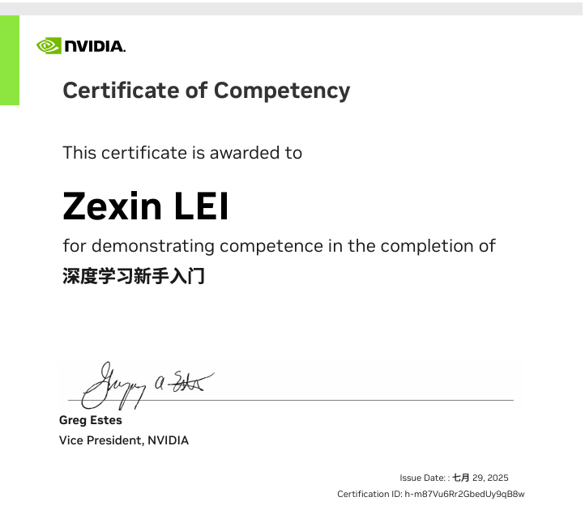
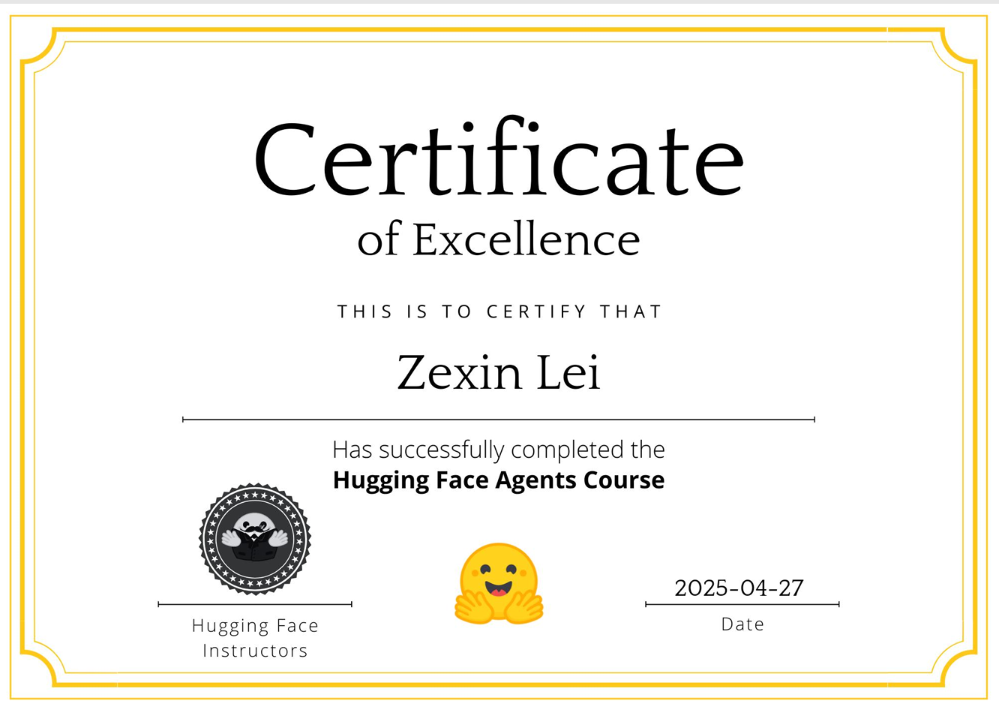

<!-- Top banner -->

  

<!-- Welcome to my Github profile page! -->

  

<!-- GitHub Stats + Streak -->

  
  

<!-- GitHub Contribution Graph -->

  

<!-- WakaTime + Top Languages -->

  
  

<!-- Skill Icons -->

  

<!-- Badges Section -->

  
  
  
  
  

<!-- Certificates Section -->

  
  
  

